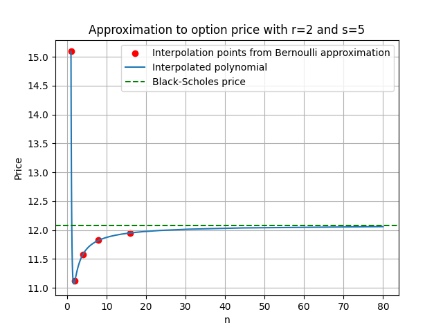

# Option pricing
## 1. Black Scholes formula

We assume that the logarithm of the stock price follows a Brownian motion, i.e. if $S_t$ is the stock price at time $t$, then
$$\log \left( \frac{S_t}{S_0} \right) \sim N(\mu t, \sigma^2 t)$$
where $\sigma$ is the _volatility_ of the stock, and $\mu = \rho - \frac{\sigma^2}{2}$ where $\rho$ is the risk-free rate. Recall the Black-Scholes formula for the price of an option,
$$\text{price} = S_0\Phi\left(\frac{\log(S_0/c) + (\rho + \sigma^2/2)t_0}{\sigma \sqrt{t_0}}\right)-ce^{-\rho t_0}\Phi\left(\frac{\log(S_0/c) + (\rho - \sigma^2/2)t_0}{\sigma \sqrt{t_0}}\right)$$
where $c$ is the strike price and $t_0$ is the expiry time. For example, here are some prices which were generated in `generate_example_prices.py`.
| $c$ | $S_0$ | $\sigma$ | $\rho$ | $t_0$ | Price |
| --- | --- | --- | --- | --- | --- | 
| 40 | 50 | 0.5 | 0.035 | 2 | 19.38 |
| 40 | 50 | 0.5 | 0.035 | 3 | 22.35 |
| 40 | 100 | 0.5 | 0.035 | 2 | 64.24 |
| 40 | 100 | 0.5 | 0.035 | 3 | 66.84 |

## 2. Bernoulli approximation
We break up the interval $[0, t_0]$ into $[0, t_0/n, 2t_0/n, \dots, (n-1)t_0/n, t_0]$ and assume that, between the times $it_0/n$ and $(i+1)t_0/n$, the increment in the logarithm of the price is $g$ or $-g$ with probability $p$ or $1-p$ respectively. We choose $g$ and $p$ so that the increment has mean $\mu t_0 / n$ and variance $\sigma^2 t_0/n$.

This is particularly useful for the American put (for example) where there is no formula available.

We implement this algorithm by taking
$$A_{i,j} = \left(pA_{i+1, j+1} + (1-p)A_{i+1, j}\right)e^{-\rho t_0 / n}$$
for $j=0, \dots, i$ and $i=n-1, \dots, 0$, with boundary conditions
$$A_{n, j} = \left(S_0 e^{(2j-n)g} - c \right)^+$$
for $j=0, \dots, n$. This algorithm has complexity $O(n^2)$. The idea is that $A_{i,j}$ represents the price at time increment $i$ given that we've taken $j$ opportunities to raise the price (so any opportunities not taken, the price will go down). The time cost of money is incorporated into the exponential factor in the first equation.

The boundary conditions then come from the price at expiry. If $j$ opportunities have been executed to raise the price, then $n-j$ times it has gone down, so the total difference in the logarithm of the price is $(2j -n)g$. Clearly, a call option only has a positive value if the strike is less than the expiry price, in which case it is simply the difference in prices.

`generate_bernoulli_prices.py` implements this algorithm, giving the following results:
| $c$ | $S_0$ | $\sigma$ | $\rho$ | $t_0$ | Price |
| --- | --- | --- | --- | --- | --- | 
| 40 | 50 | 0.5 | 0.035 | 2 | 19.47 |
| 40 | 50 | 0.5 | 0.035 | 3 | 22.40 |
| 40 | 100 | 0.5 | 0.035 | 2 | 64.25 |
| 40 | 100 | 0.5 | 0.035 | 3 | 66.93 |

which are pretty close to the true answers.

As the Bernoulli behaviour causes the price to have to choose to go up and down at every time step, we should expect that it doesn't do well on an "at-the-money" case where the strike price is equal to the current price. Indeed, it oscillates, as we can see in the following figure:

## 3. American Options
Now let's consider American options. As they can be exercised at any time, we can modify our Bernoulli approximation:
$$A_{i,j} = \max\left[\left(S_0 e^{(2j-i)g} - c \right)e^{(n-i)\rho t_0/n}, \left(pA_{i+1, j+1} + (1-p)A_{i+1, j}\right)e^{-\rho t_0 / n}\right]$$
where the boundary conditions remain the same. This is because, at each time step, we can either choose to exercise the option (first expression), or continue the process - whichever is higher in value. If we choose to exercise the option, we may freely invest the capital until the expiry date at the risk-free rate.

We can see the results in the table below, generated by `generate_bernoulli_american_prices.py`. As expected, the price of the American option is higher than that of the European option.

| $c$ | $S_0$ | $\sigma$ | $\rho$ | $t_0$ | American? | Price |
| --- | --- | --- | --- | --- | --- | --- |
| 40 | 50 | 0.5 | 0.035 | 2 | False | 19.38 |
| 40 | 50 | 0.5 | 0.035 | 2 | True | 19.55 |
| 40 | 50 | 0.5 | 0.035 | 3 | False | 22.35 |
| 40 | 50 | 0.5 | 0.035 | 3 | True | 22.76 |
| 40 | 100 | 0.5 | 0.035 | 2 | False | 64.27 |
| 40 | 100 | 0.5 | 0.035 | 2 | True | 65.86 |
| 40 | 100 | 0.5 | 0.035 | 3 | False | 66.91 |
| 40 | 100 | 0.5 | 0.035 | 3 | True | 69.59 |

## 4. Extrapolation

Instead of increasing $n$ to increase the accuracy of our approximation, we can attempt to use extrapolation.

Suppose $f_n$ is the approximation, and we want to find the limiting value as $n\to\infty$. One method we can use is to assume that $f_n$ is a polynomial in $\frac{1}{n}$:
$$f_n \approx g_0 + g_1 n^{-1} + g_2 n^{-2} + \cdots + g_s n^{-s}$$
The limiting value of $f_n$ is then simply $g_0$.

Let $n_m = r^m n_0$. Then, calculating $f_n$ at $n = n_0, \dots, n_s$ gives us $s$ equations in $g_0, \dots, g_s$ which we can use to find $g_0$. An elimination algorithm goes as follows. Set
$$a_{m, 0} = f_{n_m}$$
and then
$$a_{m, i} = a_{m, i-1} + \frac{a_{m, i-1} + a_{m-1, i-1}}{r^i - 1}$$
Then $g_0 = a_{s, s}$.

We implement this algorithm in `extrapolate.py`. The following graph is generated by `graph_extrapolaton.py`:

## 5. Binomial approximation

We can try to improve on our Bernoulli approximation, instead using a binomial variable where at each time increment we model the change in the log price by
$$\left(\frac{2X}{k} - 1\right)g$$
where $X\sim B(k, p)$ is a binomial random variable. We have scaled and translated it so that the price increment ranges from $-g$ to $g$. Now we must solve
$$(2p - 1)g = \Mu = \frac{\mu t_0}{n}, \space \frac{4g^2p(1-p)}{k} = \Sigma^2 = \frac{\sigma^2t_0}{n}$$
for $g$ and $p$. The solution is
$$g=\sqrt{\Mu^2 + k\Sigma^2}$$
$$p =\frac{\Mu + g}{2g}$$
We implement this algorithm in `binomial.py`.