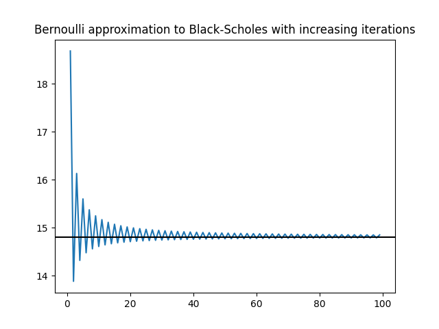

# Option pricing
## 1. Black Scholes formula

We assume that the logarithm of the stock price follows a Brownian motion, i.e. if $S_t$ is the stock price at time $t$, then
$$\log \left( \frac{S_t}{S_0} \right) \sim N(\mu t, \sigma^2 t)$$
where $\sigma$ is the _volatility_ of the stock, and $\mu = \rho - \frac{\sigma^2}{2}$ where $\rho$ is the risk-free rate. Recall the Black-Scholes formula for the price of an option,
$$\text{price} = S_0\Phi\left(\frac{\log(S_0/c) + (\rho + \sigma^2/2)t_0}{\sigma \sqrt{t_0}}\right)-ce^{-\rho t_0}\Phi\left(\frac{\log(S_0/c) + (\rho - \sigma^2/2)t_0}{\sigma \sqrt{t_0}}\right)$$
where $c$ is the strike price and $t_0$ is the expiry time. For example, here are some prices which were generated in `generate_example_prices.py`.
| $c$ | $S_0$ | $\sigma$ | $\rho$ | $t_0$ | Price |
| --- | --- | --- | --- | --- | --- | 
| 40 | 50 | 0.5 | 0.035 | 2 | 19.38 |
| 40 | 50 | 0.5 | 0.035 | 3 | 22.35 |
| 40 | 100 | 0.5 | 0.035 | 2 | 64.24 |
| 40 | 100 | 0.5 | 0.035 | 3 | 66.84 |

## 2. Bernoulli approximation
We break up the interval $[0, t_0]$ into $[0, t_0/n, 2t_0/n, \dots, (n-1)t_0/n, t_0]$ and assume that, between the times $it_0/n$ and $(i+1)t_0/n$, the increment in the logarithm of the price is $g$ or $-g$ with probability $p$ or $1-p$ respectively. We choose $g$ and $p$ so that the increment has mean $\mu t_0 / n$ and variance $\sigma^2 t_0/n$.

This is particularly useful for the American put (for example) where there is no formula available.

We implement this algorithm by taking
$$A_{i,j} = \left(pA_{i+1, j+1} + (1-p)A_{i+1, j}\right)e^{-\rho t_0 / n}$$
for $j=0, \dots, i$ and $i=n-1, \dots, 0$, with boundary conditions
$$A_{n, j} = \left(S_0 e^{(2j-n)g} - c \right)^+$$
for $j=0, \dots, n$. This algorithm has complexity $O(n^2)$. The idea is that $A_{i,j}$ represents the price at time increment $i$ given that we've taken $j$ opportunities to raise the price (so any opportunities not taken, the price will go down). The time cost of money is incorporated into the exponential factor in the first equation.

The boundary conditions then come from the price at expiry. If $j$ opportunities have been executed to raise the price, then $n-j$ times it has gone down, so the total difference in the logarithm of the price is $(2j -n)g$. Clearly, a call option only has a positive value if the strike is less than the expiry price, in which case it is simply the difference in prices.

`generate_bernoulli_prices.py` implements this algorithm, giving the following results:
| $c$ | $S_0$ | $\sigma$ | $\rho$ | $t_0$ | Price |
| --- | --- | --- | --- | --- | --- | 
| 40 | 50 | 0.5 | 0.035 | 2 | 19.47 |
| 40 | 50 | 0.5 | 0.035 | 3 | 22.40 |
| 40 | 100 | 0.5 | 0.035 | 2 | 64.25 |
| 40 | 100 | 0.5 | 0.035 | 3 | 66.93 |

which are pretty close to the true answers.

As the Bernoulli behaviour causes the price to have to choose to go up and down at every time step, we should expect that it doesn't do well on an "at-the-money" case where the strike price is equal to the current price. Indeed, it oscillates, as we can see in the following figure:
